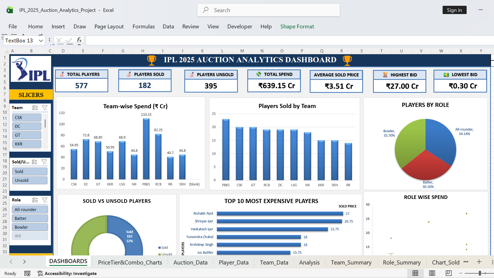
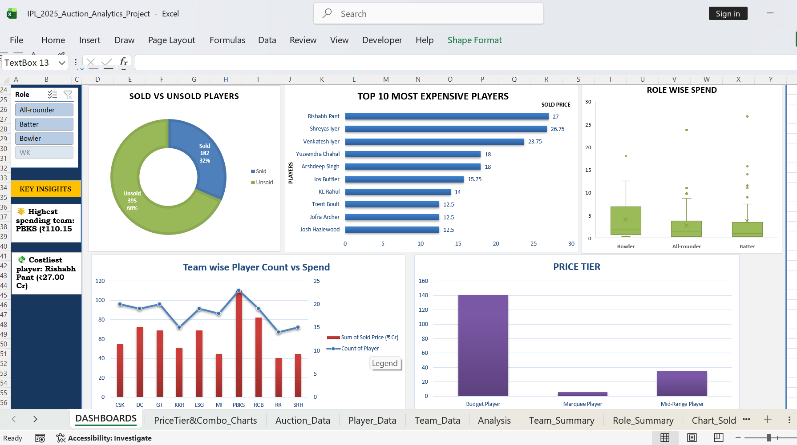
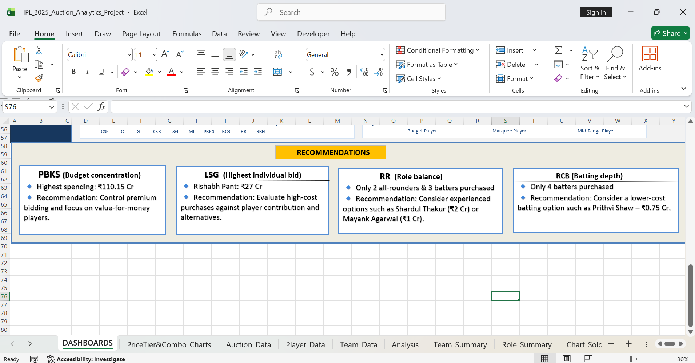

# IPL Auction Analysis Dashboard

## Project Overview

This project analyzes IPL 2025 auction data using Microsoft Excel to understand team spending, player acquisition patterns, sold vs. unsold players, auction price levels, and team-wise buying strategies.

The project goes beyond basic reporting by converting auction data into KPIs, interactive visualizations, insights, and actionable team recommendations.

## Business Objective

- Analyze how teams allocated their auction budgets.
- Compare team-wise spending and average player prices.
- Identify the most expensive purchases.
- Compare sold and unsold players.
- Understand player-role and price-tier patterns.
- Identify potential value-for-money opportunities.
- Provide data-driven recommendations for future auction strategy.

## Tools Used

- Microsoft Excel
- Excel Tables
- Data Cleaning
- XLOOKUP
- IF / IFERROR and other Excel functions
- PivotTables
- PivotCharts
- Slicers
- Timeline
- KPI Cards
- Dashboard Design

## Dataset

The workbook contains IPL auction/player data with fields including:

- Player
- Team
- Role
- Base Price
- Sold Price
- Sold/Unsold status
- Capped/Uncapped status
- Age
- Country
- IPL Matches
- Price Tier

The working dataset contains 577 player records, including 182 sold players and 395 unsold/unallocated records in the auction data.

## Data Preparation

The data was organized into separate analysis tables for auction, player, and team information. Missing values, duplicate records, and lookup-related gaps were reviewed before analysis. Relevant calculated fields and price tiers were added for dashboard analysis.

## Key KPIs

- Total Players: 577
- Sold Players: 182
- Total Auction Spend: ₹639.15 Cr
- Average Sold Price: ₹3.51 Cr
- Highest Individual Bid: ₹27 Cr
- Highest-Spending Team: PBKS – ₹110.15 Cr

## Key Insights

1. PBKS recorded the highest auction spending at ₹110.15 Cr.
2. Rishabh Pant was the most expensive player at ₹27 Cr.
3. Bowler purchases had the highest average sold price among the three main roles in the role analysis.
4. The dashboard compares team spending, player counts, sold/unsold status, price tiers, and auction values through interactive visuals.

## Team-wise Recommendations

The recommendations are based on the team's purchased role mix, spending pattern, and player opportunities visible in the dataset.

PBKS (Budget concentration)
🔹 Highest spending: ₹110.15 Cr
🔹 Recommendation: Control premium bidding and focus on value-for-money players.

LSG  (Highest individual bid)
🔹 Rishabh Pant: ₹27 Cr
🔹 Recommendation: Evaluate high-cost purchases against player contribution and alternatives.

RR  (Role balance)
🔹 Only 2 all-rounders & 3 batters purchased
🔹 Recommendation: Consider experienced options such as Shardul Thakur (₹2 Cr) or Mayank Agarwal (₹1 Cr).

RCB (Batting depth)
🔹 Only 4 batters purchased
🔹 Recommendation: Consider a lower-cost batting option such as Prithvi Shaw – ₹0.75 Cr.

> Note: These recommendations are analytical suggestions based on the project dataset, not predictions of actual IPL team decisions.

## Dashboard Preview

## Dashboard Preview

### Dashboard – Part 1

### Dashboard – Part 2

### Team-wise Recommendations

## Project Structure

IPL-Auction-Analysis/
├── README.md
├── IPL_2025_Auction_Analytics_Project.xlsx
└── Dashboard/
    ├── Dashboard_1.png
    ├── Dashboard_2.png
    └── Recommendation.png

## Conclusion

The analysis shows how Excel can be used to transform auction data into a decision-support dashboard. The project combines data cleaning, lookup functions, PivotTables, visualization, KPI reporting, and business recommendations to explain team spending and player acquisition patterns.

